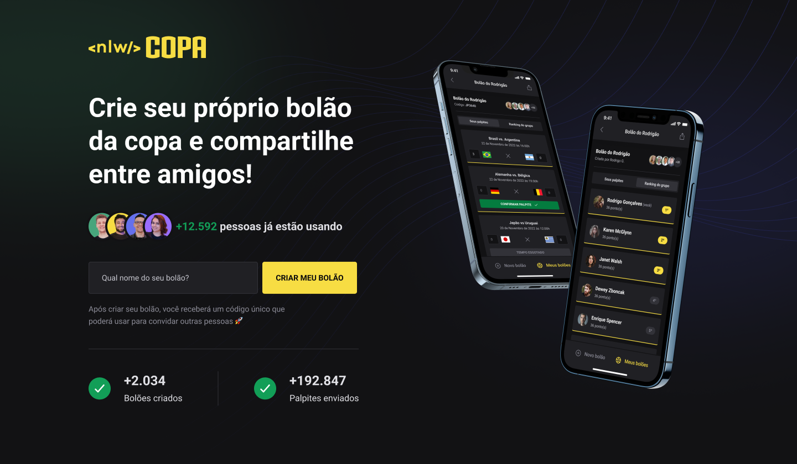

<h1 align="center">Bolão NLW</h1>
&nbsp;
<h2 align="center">Aplicação para criar bolões para a Copa do Mundo de 2022. feito com NextJS e TypeScript.</h2>
&nbsp;

  <a href="#-tecnologias">Tecnologias</a>&nbsp;&nbsp;&nbsp;|&nbsp;&nbsp;&nbsp;
  <a href="#-projeto">Projeto</a>&nbsp;&nbsp;&nbsp;|&nbsp;&nbsp;&nbsp;
  <a href="#memo-licença">Licença</a>

&nbsp;

 
  
  

    

 

  

# 📄 Descrição:

### O que foi desenvolvido?

- Aplicação Web completa feita durante o evento NLW Copa, da Rocketseat.

&nbsp;
&nbsp;
&nbsp;

# 🖥️ Tecnologias:

Esse projeto foi desenvolvido com as seguintes tecnologias:

### React

### NextJS

### TypeScript

### TailwindCSS

### Axios

&nbsp;
&nbsp;
&nbsp;

# 🚧 Projeto:

### [Em breve!](https://aquecimento-nlw-copa.vercel.app/)

&nbsp;
&nbsp;
&nbsp;

# 🚀 Como executar:

- Clone o repositório

- Instale as dependências com `npm install`

- Inicie o servidor com `npm run dev`

Agora você pode acessar [`localhost:3000`](http://localhost:3000) do seu navegador.

&nbsp;
&nbsp;
&nbsp;

# 🎨 Inspiração:

### [NLW Copa](https://www.youtube.com/watch?v=sswJisbD2CY&t=5s/)

&nbsp;
&nbsp;
&nbsp;

# 📝 Licença:

Esse projeto é open source, idealizado e realizado pela Rocketseat.

&nbsp;
&nbsp;
&nbsp;

Made by <a href="https://wwwjhonatan.oliveira.com/" target="_blank">Jhonatan Oliveira</a>.

